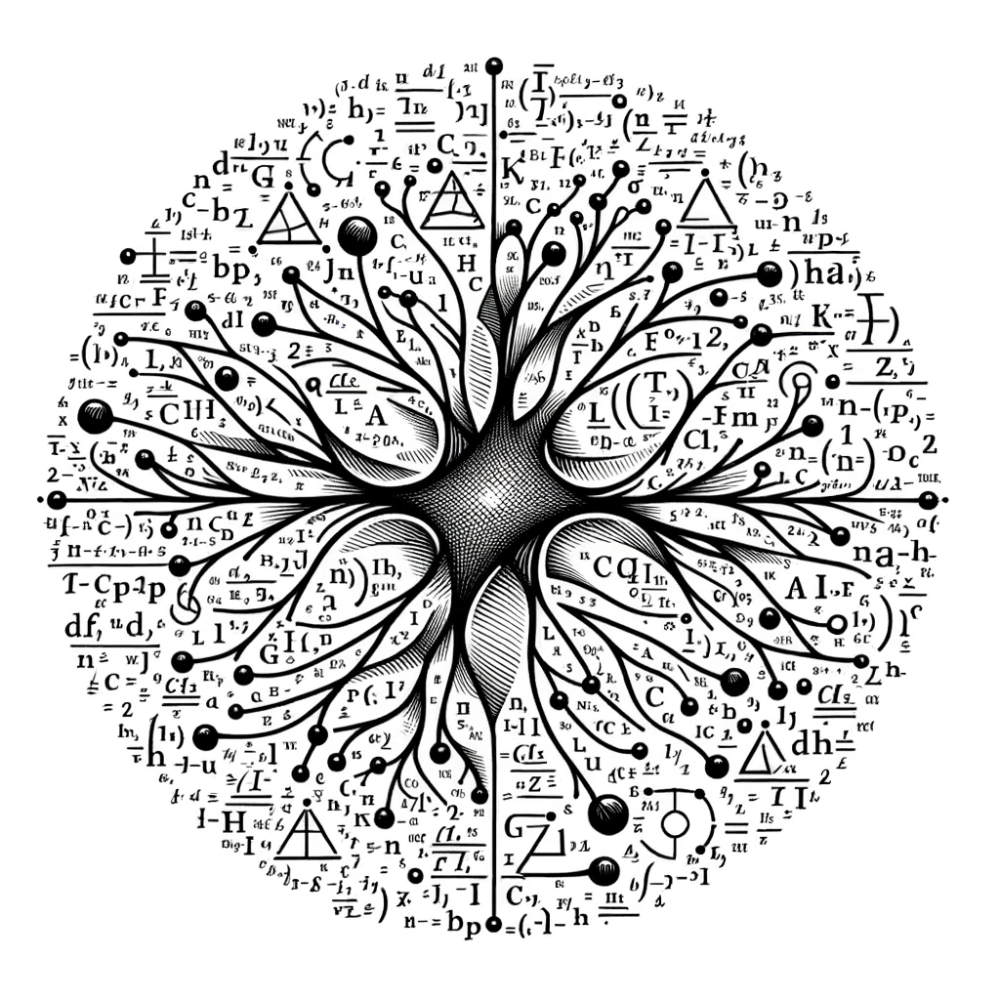
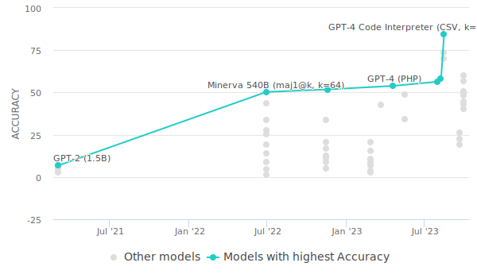
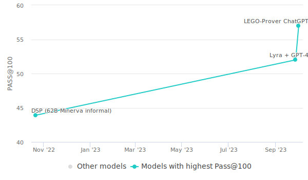

# LLM-MATH

基于自然语言处理的生成式大模型已经在很多领域，包括知识，写作，理解上达到甚至超过了人类水平。但与大模型在许多领域上超越人类的表现不同,
在需要复杂推理的数学领域上，大模型与人类、甚至大模型与大模型之间的差异依然显著,
GPT-4的数学能力只相当于一个成绩中等的数学系学生(Frieder et al. 2023),
而在普遍被用于衡量数学能力的GSM8K（小学水平的数学应用题）,
MATH数据集（数学竞赛及本科水平）上,
GPT-4要优于目前最先进的开源大模型2-4倍,
因此模型的数学能力也可以被间接用于评估模型的性能。 另一方面,
随着大语言模型的能力增长，对其在特定领域，如数学的应用也引发了广泛关注。不仅仅是解决基础数学应用题，更高级的自动定理证明也逐渐被看作是大模型的潜在应用领域。这使得如何提高模型的推理和数学能力，利用大模型解决更复杂的数学问题,
成为日益受到关注的问题。

<!-- 但是在逻辑推理方面，大模型依然存在很多不足。鉴于其基于自回归的生成式特性和自注意力机制计算复杂性带来的长度要求，大模型往往无法很好地处理包含多步逻辑的任务。2023年以来，对大模型多步推理能力加强的方案在训练端和推理端被陆续提出，包括CoT, ToT以及CoT tuning等，这些方法极大加强了模型在逻辑方面的能力和潜力，但是，对于完全依赖于逻辑的数学领域，这些方法仍然不够，以小学数学题GSM8k为例，目前主流的中文模型在不借助外部推理端辅助的情况下，其准确率仅有50 -->
<!-- 为了真正使大模型具备复杂的数学推理能力，并帮助人类探索数学领域，需要开展以下技术研究： -->
<!---->
<!-- 1. 数学语境下的知识增强：研究大模型在特定数学语境下的知识表达，如数学公式、理论和定律，进而构建数学知识增强的模型训练框架。 -->
<!-- 1. 自动定理证明技术：研究如何利用大模型进行定理的自动证明，包括但不限于基于逻辑的证明方法、基于经验的证明策略以及与其他数学软件的集成。 -->

数学作为一个极度依赖多步逻辑的学科，解决数学问题的能力客观地反映了模型的逻辑水平和对上下文之间隐含知识的充分理解，因此增强大模型的数学能力是真正意义上提高大模型智能水平的重要标志。
对于数学相关的题目和任务，我们按照解决问题所需要的模型能力层级，将其分为三级,
并维护相应的排行榜。

## 算术推理

这类题目的问题和答案都主要基于自然语言描述，答案附带含有四则运算的算术式对题目中出现的数量关系进行转换和理解，并借由步骤来分隔解题逻辑，最终通过一步一步地推理和运算，得到最终答案，其难度主要是小学数学题，小学奥数题和部分初中题目，代表性的任务数据集是GSM8k。解决这类问题需要模型具备逐步推理能力和简单的计算能力。

## 数学应用题（Math word problem)

这类题目同样含有自然语言描述，但题目包含代数式和方程，往往没有充足的自然语言描述的实体对象，是相较于应用题更加抽象的数学题目。模型需要经过代数符号与代数式的推导和方程求解得到最终答案，其难度类似于中学数学竞赛以及本科数学的题目，代表性的数据集是MATH。解决这类问题需要模型具备较为完整的数学知识体系，理解抽象概念和符号的能力同时根据这些概念进行创造性推理的能力。

## 定理证明

这类问题包括复杂的数学证明和所有我们真正关心的数学问题，由于其严谨的逻辑性和抽象性，其难度远远超过了前两类问题。由于其自然语言数据的相对匮乏和命题的多样性，我们无法通过简单分析模型的输出评判模型回答的对错，对于这类问题，我们需要将问题转化为机器证明语言，通过训练和提示让模型输出合法的计算机语句来完成命题的证明。代表性的数据集和评价指标包括miniF2F、ProofNet和IMO
Grand
Challenge。解决这类问题需要模型的数学能力与代码能力的深度对齐，甚至需要外挂知识库和评估模式来指导和优化模型产生正确的输出。

Frieder, Simon, Luca Pinchetti, Ryan-Rhys Griffiths, Tommaso Salvatori,
Thomas Lukasiewicz, Philipp Christian Petersen, Alexis Chevalier, and
Julius Berner. 2023. “Mathematical Capabilities of ChatGPT.” arXiv.
<http://arxiv.org/abs/2301.13867>.

